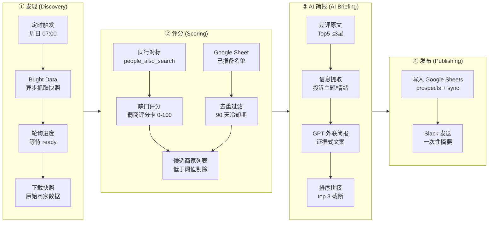

# docs/00-overview.md

## 流程总览：Find weak local Google Business profiles with Bright Data, GPT-5.6, Sheets and Slack

### 结论先行

这是一个**每周日凌晨自动扫描特定城市 Google Maps 商家 → 量化评分发现"弱势商家" → AI 撰写开发信 → 去重入库 + 通知**的完整入站拓客工作流。32 个节点 = 8 个说明便签 + 24 个功能节点，核心价值不在"抓数据"，而在**用评分卡把"商机发现"变成可复制、可防错的工程化流程**。

整个工作流可抽象成一条 4 段主链：



---

### ① 发现（Discovery）：从城市关键词到原始商家数据

| 项 | 说明 |
|---|---|
| **输入** | 定时触发器（Cron，周日 07:00）预置的 `keyword`（品类 + 城市）、`country` |
| **处理** | 通过 **Bright Data 异步数据集 API** 请求 Google Maps 商家数据 |
| **输出** | 原始商家列表（含名称、地址、评分、评论数、照片数、营业时间、`people_also_search`、`top_reviews` 等字段） |
| **依赖凭证** | `Bright Data API Key` |

**调用链（技术细节）**：

```
POST /datasets/v3/trigger
  dataset_id: gd_m8ebnr0q2qlklc02fz
  payload: [{ keyword: "品类+城市", country: "目标国家" }]
        ↓
返回 snapshot_id
        ↓
轮询 GET /progress/{snapshot_id}   （最长 20 次 × 20 秒 = ~6.7 分钟）
  状态: failed / running / ready
        ↓
ready 后 GET /snapshot/{snapshot_id} 下载完整 JSON
```

---

### ② 评分（Scoring）：用评分卡筛出真正"弱"的商家

| 项 | 说明 |
|---|---|
| **输入** | 上一步的原始商家数据；Google Sheet 中已报备过的历史 `prospects` 名单 |
| **处理** | ① 同行对标 → ② 缺口计分 → ③ 冷却去重 → ④ 阈值过滤 |
| **输出** | 候选商家列表（低于 `min_gap_score` 的已剔除；90 天内已联系过的不再骚扰） |
| **依赖凭证** | `Google Sheets OAuth` |

**评分卡结构（满分 100，分越高 = 缺口越大 = 越值得开发）**：

| 分数 | 判据 |
|---|---|
| +25 | 门店**未认领**（无主） |
| +20 | **无网站** |
| +15 | 评分**低于同行 ≥ 0.3** |
| +15 | **差评率 ≥ 15%** |
| +12 | 评论数**不到同行中位数 40%** |
| +8 | **照片 ≤ 3** 张 |
| +10 | **无营业时间** |
| +5 | **单一品类**（服务范围窄） |
| +5 | **无服务项** |

**同行对标来源**：抓取结果里自带的 `people_also_search`（谷歌"用户还搜了"面板），取其中位数作为 `peer_rating` / `peer_reviews` 的参考基准。

---

### ③ AI 简报（AI Briefing）：从差评原文到证据式销售话术

| 项 | 说明 |
|---|---|
| **输入** | 评分阶段筛选出的商家的 **`top_reviews`（仅保留 ≤3 星的差评，最多 5 条）** 作为 AI 阅读材料 |
| **处理** | ① 信息提取器（LangChain InformationExtractor）抽取投诉主题 → ② LLM 生成证据式外联简报 → ③ 排序拼接（top 8 深度截断） |
| **输出** | 每个商家一条 `pitch` 文案 + 结构化摘要（`complaint_themes` / `has_complaints` / 最大投诉类型） |
| **依赖凭证** | `OpenAI API Key`（可换 DeepSeek，改 baseURL 即可） |

**文案风格硬规则——纯证据式，禁止主观形容词**：

```
pitch = 商家名: 证据1 和 证据2. Reviewers mention 主题1 和 主题2.
```

**情绪兜底逻辑**：无论抽取出的情绪枚举多混乱，最后统一归到 4 档——

```
mixed / mostly negative / mostly positive / unclear
```

---

### ④ 发布（Publishing）：入库 + 通知

| 项 | 说明 |
|---|---|
| **输入** | AI 简报阶段的 `(message, rows)` 元组（Slack 消息内容 + 待写入 Sheet 的行数据） |
| **处理** | ① `prospects` 表逐行写入（本轮新线索）；② `sync` 表写入（供下次跑批做去重回扫）；③ Slack 发送一次性摘要 |
| **输出** | Google Sheet 中新增本批线索；Slack 收到 top 摘要 |
| **依赖凭证** | `Google Sheets OAuth`、`Slack Bot Token` |

**写入与发送的截断约定**：AI 生成的候选超过 8 条时，只深度处理 top 8 并写入 / 发送，避免一次打扰过多商家。

---

## 凭证映射表

| 服务 | 用途 | 需要配置的凭证项 | 备注 |
|---|---|---|---|
| **Bright Data** | Google Maps 商家数据抓取 | `databaseId`（`gd_m8ebnr0q2qlklc02fz`）+ `API Token` | 异步任务制，接口地址预设，核心是 dataset 的 `trigger/progress/snapshot` 三段式调用 |
| **Google Sheets** | ① 已报备名单读取（冷却去重基准）；② 新线索落地 + 回扫名单写入 | OAuth2 凭据 + 目标 Spreadsheet ID | 同一张表内双用途：读 `已报备` 列做 Date.parse 判断，写 `prospects` / `sync` 两个区块 |
| **LLM（OpenAI 兼容）** | ① 差评信息提取；② 外联简报生成 | `baseURL: https://api.deepseek.com` + API Key | 原模板写 `gpt-5.6-terra`（不可考），实测用 **DeepSeek** 直接换 baseURL 即可跑通；也可接回 OpenAI 官方 |
| **Slack** | 发送每周摘要提醒（一次性，不逐条打扰） | Bot Token + 目标 Channel ID | 纯通知角色，不承载数据回传 |

---

## 坑点提示：为什么异步快照必须轮询，而不是同步等待？

Bright Data（以及大部分第三方抓取服务）**不在 HTTP 响应里同步返回数据**，原因有三：

1. **抓取耗时不可控**：Google Maps 数据抓取受反爬、分页、地理定位影响，单次请求可能 30 秒到数分钟不等。若放在一个 HTTP 请求里同步完成，客户端长时间挂起极易超时、断连，且服务端负载不可控。
2. **服务端是任务队列架构**：Bright Data 在收到 `trigger` 后只是把任务**丢进队列**，返回给你的是一个 `snapshot_id`（任务凭证），而任务本身在后台异步执行。HTTP 协议本身无法在单次响应里表达"任务完成后回调"的语义——除非用 Webhook，但 Webhook 需要双方都有公网可达端点，复杂度更高，不适合前端定时器场景。
3. **轮询是成本可控且幂等的折中**：模板实测在 `progress` 接口轮询，最多 20 次 × 20 秒 = 6 分 40 秒兜底。这样既不需要长连接，又能容忍中间态的失败（比如某次轮询网络抖动，下一次轮询重试即可）。

> 💡 **扩展思考**：模板里专门有一个 Code 节点判断"HTTP 200 但 body 里含 error 字段"的情况——作者原话是"Bright Data 常常 200 返回错误"。这说明**响应状态码不代表业务成功**，轮询时必须双保险：既看 HTTP 层面，也看 JSON 业务层面的 `status` 字段。这属于防御式写法的精华之一，教学上务必带学员重点观察这个节点。