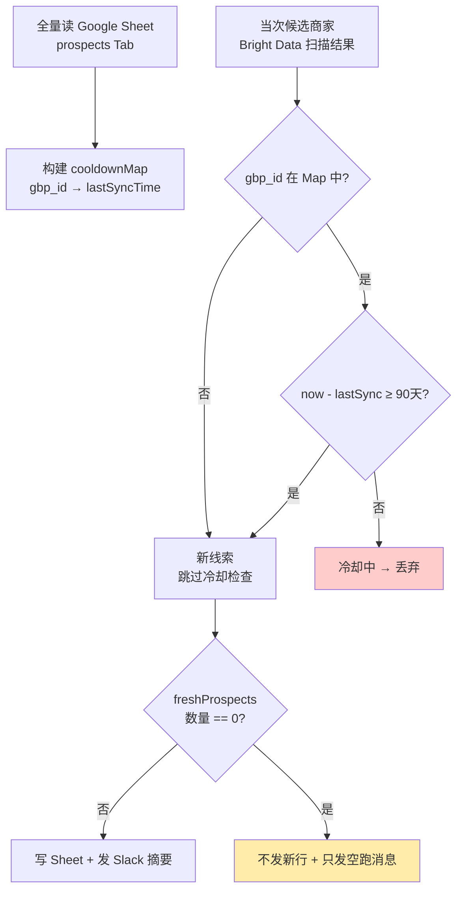

## 第 3 段 · 去重 + 冷却（Google Sheet 即“业务状态机”）

### 结论先行

模板的**第 9 节点 Cluster（Write to Sheet + Cooldown）**是整个流程的“业务防火墙”：
它用 **Google Sheet 既当入库表、又当冷却判定的状态源**，用 **90 天写入窗口** 保证同一条商家线索最多每季度被触达一次，
并且**在无可触达新线索时主动走向“安静分支”（不发 Slack、不写新行）**。

架构核心：`sync` 列 = 上次报备时间，`prospects` 表 = 已报备名单，二者同一张 Sheet，没有单独建库。

---

### 1. 设计哲学：Sheet 即状态，而不是数据库

模板的 Google Sheet 结构（两个 Sheet Tab）：

| Tab 名 | 用途 | 字段要点 |
|--------|------|----------|
| `prospects` | 待跟进 / 已报备商家总表 | `gbp_id`（唯一键）、`name`、`score`、`pitch`、**`sync`（上次报备时间）** |
| `report` | 当次运行的摘要写入 | 时间戳、新报备条数、静默标记 |

设计哲学一句话：**去重逻辑不依赖独立数据库，而是通过“读 Sheet 已有行 → 比对 gbp_id + sync 时间”实现**。

- 新增线索 → 先查 `prospects` 是否已有同 `gbp_id`。
  - 有 → 检查 `sync` 距今是否 ≥ 90 天，否则记为“冷却中”，跳过；
  - 无 → 作为新线索继续评估，写入时 `sync = 当前时间`。
- **Sheet 本身是有状态的数据源**，流程启动时读一次全量，运行期间内存中判定。

> 为什么这样做？
> 因为业务运营方（非工程师）可以直接看 Sheet、手动编辑、拖拽排序，不需要数据库后台。
> 要临时把某家店拉黑？直接删行或改 `sync` 为 2030 年即可，改完下一次运行立刻生效。

---

### 2. 冷却窗口：90 天，防骚扰，也给商家整改时间

- **常数定义**：`COOLDOWN_DAYS = 90`（模板源码里的顶部常量）。
- **判定逻辑**：

```
上次报备时间 sync
↓
if (now - sync < 90 天) → 冷却中，跳过（不生成新 pitch）
else → 冷却到期，可再次报备（重新抓取最新评分数据后再评一次分）
```

- **为什么是 90 天**：给商家至少一个季度去完成“认领档案、补照片、回复差评”等整改动作。
  如果 7 天就重扫，商家还没行动，纯属骚扰且浪费 GPT tokens。

---

### 3. 去重的数据流伪代码（Code 节点里发生了什么）

```js
// 简化版逻辑（模板中为多 Code 节点组合，此处为教学合并）

const rows = sheetData // 来自 Google Sheets 节点，全量读出
const cooldownMap = new Map()

rows.forEach(r => {
  const gbpId = r.gbp_id
  const syncStr = r.sync
  
  // 坑点1：Date.parse 失败按“已报备”处理
  let syncTime = Date.parse(syncStr)
  if (isNaN(syncTime)) {
    // sync 列是空、非标准格式、或 “N/A” 时，保守判定为“已报备且永不过期”
    syncTime = Infinity
  }
  
  cooldownMap.set(gbpId, syncTime)
})

// 对当次扫描到的候选商家 candidates（来自 Bright Data）逐个判定：
const freshProspects = candidates.filter(c => {
  const lastSync = cooldownMap.get(c.gbp_id)
  if (lastSync === undefined) return true          // 从未报备过 → 新线索
  const daysSince = (Date.now() - lastSync) / 86400000
  return daysSince >= COOLDOWN_DAYS                 // 冷却已过 → 可再次报备
})

// 输出：如果 freshProspects.length === 0 → 走向“安静分支”（坑点2）
```

---

### 4. 坑点 1：Date.parse 失败时按“已报备”处理（防重复触达）

这是模板里 **防御式写法最典型的一处**：

```js
let cooldownEnd = Date.parse(syncValue)
if (isNaN(cooldownEnd)) {
  // 任何无法解析的日期（空值、人写的 “昨天”、偶发脏数据）
  // 一律视为“很早之前就报备过，且冷却期永未结束”
  cooldownEnd = Infinity
}
```

- **为什么是 `Infinity` 而不是 `0`？**
  - 如果解析失败按 `0`（即 1970-01-01），那 `now - 0 > 90天` 永远成立 → 会重复触达这家店；
  - 解析失败意味着数据不可信，**宁可漏报不可骚扰** → 设为 `Infinity` → 永远在冷却中，不发送。
- **业务语义**：sync 字段坏掉了？那这家店先别碰，等人工去 Sheet 里修好时间再放行。

> 如果你把解析失败按“0 处理”，几天内就可能对同一商家发两封外联邮件——这在真实运营场景等于自毁渠道。

---

### 5. 坑点 2：“安静分支” —— 无新线索时怎么走

模板 Code 节点会返回一个 `marker`：

```js
// 判定后输出（供后续 IF 节点做分支）
if (freshProspects.length === 0) {
  return { 
    no_new_prospects: true,   // ← 关键 marker
    rows_to_append: [],
    summary_message: null
  }
} else {
  return {
    no_new_prospects: false,
    rows_to_append: freshProspects,
    summary_message: `发现 ${freshProspects.length} 家新可触达门店`
  }
}
```

**下游分支逻辑：**

```
IF no_new_prospects == true
  ├─ 写 Sheet？ → 不写（无新行）
  ├─ 发 Slack？ → 仍发一条，但内容是 “本周扫描完成，无新可触达目标” 
  │                （注意：不是完全静默，是发“空跑通知”）
  └─ 流程结束
```

**关键教学点**：模板**没有完全跳过 Slack 节点**，而是发一条**空跑状态消息**（防止运营以为流程挂了），但**不追加 Sheet 行、不调 GPT 写外联文**。

> 千万不要在这个分支把整个流程 Stop 掉——那样运营连“跑过了”都不知道。
> 正确姿势：发一条“安静确认”消息，保留审计痕迹。

---

### 6. 为什么是 Google Sheet 而不是数据库？

| 维度 | Google Sheet | 传统数据库（如 Postgres） |
|------|--------------|--------------------------|
| 运营方读取 | 双击即开，无门槛 | 需要连接工具或写 SQL |
| 人工干预 | 直接改格、加批注、加颜色 | 需要后台或 SQL 语句 |
| 审计追踪 | 单元格历史可见 | 依赖日志表 |
| 集成成本 | n8n 原生节点，OAuth 一次搞定 | 需要维护连接池、迁移等 |
| 规模上限 | 单表 ~10M 格（本场景 1 万商家 = 余量充足） | 无上限但杀鸡用牛刀 |

**模板作者取舍逻辑**：本场景是 **中小规模（数百到数千商家）的定期扫描**，
对**一致性和事务性**要求极低，但对**业务可读性和人工介入便利性**要求极高。
- 选 Sheet：业务方能直接在表格里改 `sync` 字段来“手动拉黑/放行”，改完下一轮自动生效；
- 选数据库：每次人工干预都要写 SQL、过审批，**冷却调整成本远高于 90 天窗口本身的价值**。

---

### 7. 教学小结：这张图记住去重模块全貌



---

### 8. 坑点清单速查（本段 3 个坑）

| # | 坑点 | 正确姿势 |
|---|------|----------|
| 1 | `Date.parse` 对脏数据返回 `NaN` | 解析失败 → 设 `Infinity`（按“已报备且永不过期”对待） |
| 2 | 全部商家冷却中时 | 返回 `no_new_prospects = true` 标记 → **发空跑通知单，不写新行、不调 GPT** |
| 3 | Sheet 误当成数据库去设计（加外键、搞关系表） | 保持**扁平的“名单 + 下次